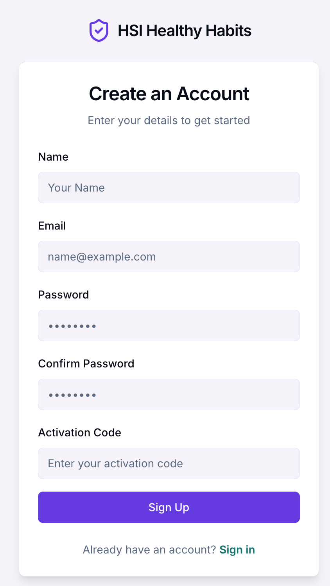
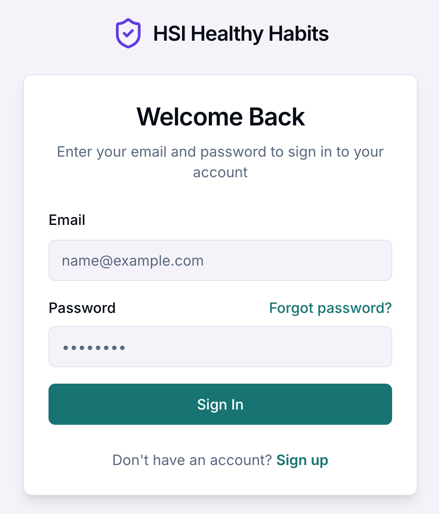

# 📱 HSI Healthy Habits App

## 1. Create an Account

When you first open the app, you’ll see the **Create an Account** screen.

### Steps:
1. Enter your **Name**
2. Enter your **Email address**
3. Create a **Password**
4. Confirm your password
5. Enter your **Activation Code** (provided by the study/admin)
6. Click **Sign Up**

> Already have an account? Click **Sign in** at the bottom.

---

## 2. Sign In

If you already have an account:

1. Enter your **Email**
2. Enter your **Password**
3. Click **Sign In**

Optional:
- Click **Forgot password?** if needed
- Click **Sign up** if you don’t have an account

## 👤 3. Manage Your Profile

Go to **Settings → User Profile**

### You can:
- View your **Name & Email**
- Check **Study Start**
- Upload study data again if needed
- Click **Edit** to update details
