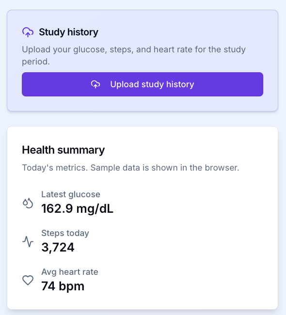
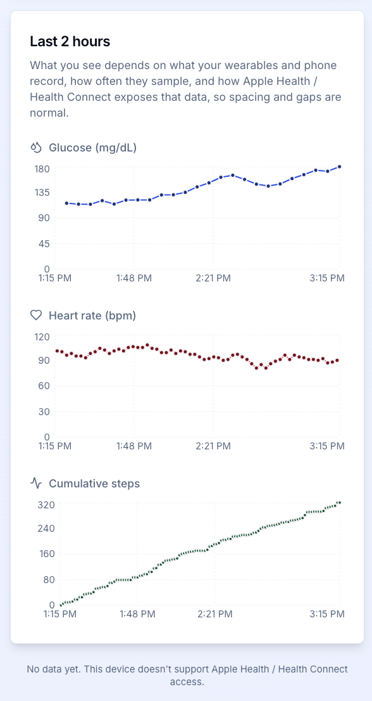
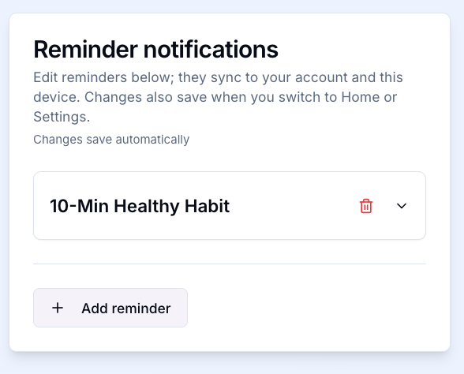
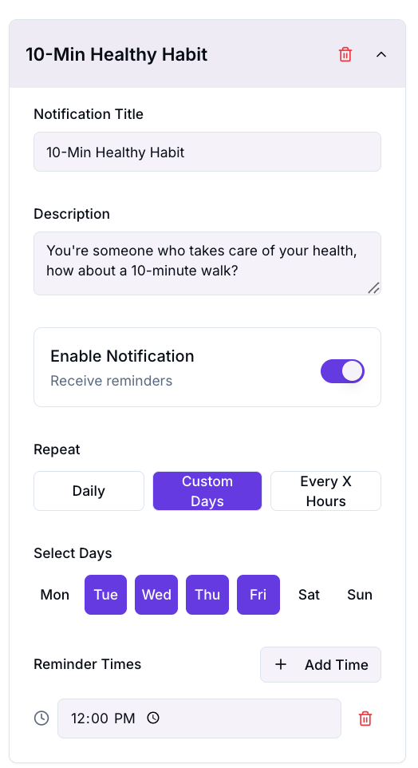
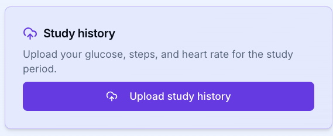

# 📱 HSI Healthy Habits App — Setup Guide

This guide walks you through setting up and using the **HSI Healthy Habits** app for the first time.

## ⚠️ Medical Disclaimer

- This app is **not a medical device**
- Not for diagnosis or treatment
- Data is **research-only**
- Health data comes from external sources (Apple Health / Health Connect)

## 📌 Navigation Overview

Bottom navigation bar includes:

- 🏠 **Home** — Dashboard
- 🔔 **Notifications** — Habit reminders
- ⚙️ **Settings** — Profile & app settings

## Account

Follow the [account](./Account.md) setup guide to set up an account.

---

## 🏠 Home Dashboard Overview

Once logged in, you’ll see your **Health Dashboard**, which includes:

> ⚠️ Note: Data appears only if connected via Apple Health or Health Connect.

### 🧾 Health Summary:
- Latest glucose reading
- Steps today
- Average heart rate

### 📊 Last 2 hours trend:

- **Glucose (mg/dL)** – recent readings
- **Steps** – step counts
- **Heart Rate (bpm)** – average heart rate over time

---

## 🔔 Set Up Notifications (Healthy Habits)

Navigate to **Notifications** tab to create reminders.

### Create a Reminder:
1. Click **Add reminder**
2. Set:
   - **Notification Title** (e.g., *10-Min Healthy Habit*)
   - **Description** (e.g., *Take a 10-minute walk*)
3. Toggle **Enable Notification**

### ⏰ Configure Schedule:
- Choose **Repeat Type**:
  - Daily
  - Custom Days (select specific weekdays)
  - Every X Hours
- Set **Reminder Time(s)**

Example:
- Tue–Fri at 12:00 PM

---

## 📤 Upload Study Data

To participate in the study:

1. Go to **Study History**
2. Click **Upload study history**
3. Allow access to:
   - Glucose
   - Steps
   - Heart Rate

